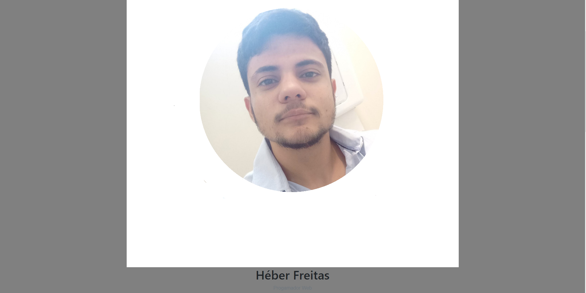
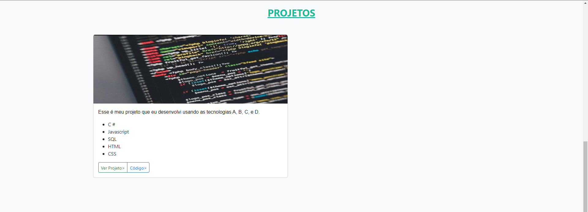
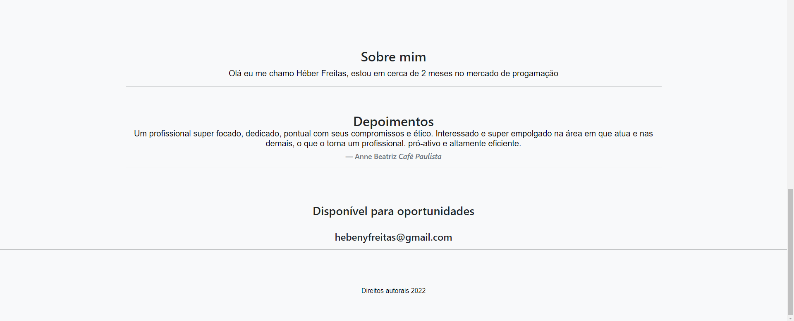

# portfolio-heber
<h1 align="center">Olá 👋, sou Héber Rayan de Freitas</h1>
<h3 align="center">Portifolio</h3>

  

- 🔭 Programador web **importa**

<h3 align="left">Conectar comigo:</h3>

<h2>telas</h2>

<h2>telas</h2>

<h2>telas</h2>

<h2
<h3 align="left">Idiomas e Ferramentas:</h3>

        

 

